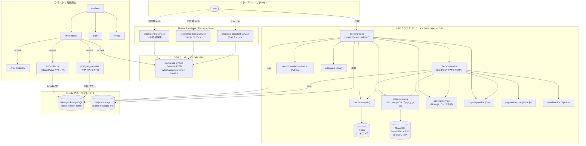

[English](./README.md) | **日本語**

# Akamai Microservices Demo

> **Akamai の各種サービスを組み合わせた、エンドツーエンドのデモ環境です。**
> LKE（Linode Kubernetes Engine）上のマイクロサービス EC サイトに、
> Akamai Functions によるエッジ AI、Linode のマネージドサービスによる
> データ永続化、クラスタ内 Grafana スタック + Akamai Cloud Pulse に
> よるフル可観測性を統合した構成です。

[](https://github.com/ymori-aka/akamai-microservices-demo/actions/workflows/deploy.yml)

---

## 目次

- [デモで見せられること](#デモで見せられること)
- [アーキテクチャ](#アーキテクチャ)
- [技術スタック](#技術スタック)
- [データ永続化](#データ永続化)
- [可観測性](#可観測性)
- [デモ環境へのアクセス](#デモ環境へのアクセス)
- [セットアップ手順](#セットアップ手順)
- [CI/CD パイプライン](#cicd-パイプライン)
- [商品管理画面の使い方](#商品管理画面の使い方)
- [リポジトリ構成](#リポジトリ構成)
- [ライセンス・派生元について](#ライセンス派生元について)

---

## デモで見せられること

| # | シナリオ | 訴求ポイント |
|---|----------|-------------|
| 1 | **EC サイトを LKE で運用** | マネージド Kubernetes の手軽さ、スケーラビリティ |
| 2 | **Akamai Functions で商品紹介を AI 生成** | エッジで動く Function から、GPU 上の LLM（Gemma 4）を低レイテンシで呼び出し |
| 3 | **AI によるパーソナライズドおすすめ** | 閲覧中の商品に応じた動的なレコメンド |
| 4 | **AI ショッピングアシスタントとチャット** | Spin Function 経由で Gemma にチャット問い合わせ |
| 5 | **4 言語 UI** | 英語 / 日本語 / 한국어 / 中文 をワンクリックで切り替え |
| 6 | **8 通貨対応** | USD / EUR / JPY / CAD / GBP / TRY / KRW / CNY、ライブ為替レート |
| 7 | **注文履歴の永続化** | Linode Managed PostgreSQL に注文を保存、`/orders` / `/admin/orders` で閲覧 |
| 8 | **MongoDB ベースの商品カタログ** | StatefulSet + PVC、初回起動時に自動シード、管理画面から CRUD |
| 9 | **商品画像を Linode Object Storage で配信** | `*.linodeobjects.com` から画像を提供（クラスタ内配信ではなく） |
| 10 | **クラスタ内 Grafana + Cloud Pulse** | DB / LB / LLM のメトリクスを 1 つのダッシュボードで表示。前日・当日の注文数と売上を PostgreSQL から直接クエリして表示 |
| 11 | **LLM のエンドツーエンド計装** | モデル別の token 使用量、レイテンシ p50/p95/p99、エラー率 |
| 12 | **GitHub Actions による自動デプロイ** | push → build → LKE デプロイ → Akamai Functions デプロイを完全自動化 |
| 13 | **認証付き商品管理画面** | 商品の追加・編集・削除・在庫管理をブラウザから実施 |

---

## アーキテクチャ



---

## 技術スタック

| レイヤ | 技術 | 役割 |
|--------|------|------|
| **インフラ** | Linode Kubernetes Engine (LKE) | Kubernetes クラスタ（3 ノード） |
| **エッジ AI** | Akamai Functions (Fermyon Spin v3.6.3) | TypeScript Wasm をエッジで実行 |
| **AI モデル** | Gemma 4 26B / llama-cpp-python | GPU サーバー上のオープンソース LLM、OpenAI 互換 API |
| **フロントエンド** | Go + HTML テンプレート | EC サイト本体（en / ja / ko / zh） |
| **マイクロサービス** | Go / Python / Node.js / Java | カート、決済、為替、配送ほか |
| **カタログストア** | MongoDB 7.0（クラスタ内 StatefulSet + PVC） | 商品カタログ（`products.json` から自動シード） |
| **注文ストア** | Linode Managed PostgreSQL | `orders` / `order_items` テーブルに永続化 |
| **カートストア** | Redis | セッション単位の一時的なカート |
| **画像ストア** | Linode Object Storage | public-read バケットから `/static/img/products/*` を配信 |
| **可観測性** | Prometheus / Loki / Tempo / Grafana / Grafana Alloy / Beyla / OTel Collector | メトリクス、ログ、トレース、eBPF |
| **マネージド系メトリクス** | Akamai Cloud Pulse (`aclp-collector`) | DBaaS + NodeBalancer のメトリクスを Prometheus に橋渡し |
| **ビジネス KPI メトリクス** | `postgres_exporter`（カスタムクエリ） | 前日・当日の注文数と売上を PostgreSQL から直接クエリし Prometheus ゲージとして公開 |
| **LLM メトリクス** | prometheus-fastapi-instrumentator + カスタム middleware | モデル別 token / レイテンシ / エラー率 |
| **CI/CD** | GitHub Actions + セルフホスト Runner | push → build → デプロイの自動化 |
| **コンテナレジストリ** | GitHub Container Registry (ghcr.io) | Docker イメージの保管先 |

---

## データ永続化

デモを支える 3 種類のデータストア。いずれも Kubernetes マニフェスト + GitHub
Secrets で構成され、毎回の push で CI から自動デプロイされます。

| ドメイン | 場所 | スキーマ / 形式 |
|----------|------|---------------|
| **商品カタログ** | クラスタ内 MongoDB 7.0 StatefulSet（`mongodb-0`, 10 Gi PVC） | 1 商品 1 ドキュメント（`_id` = SKU、多言語 `name` / `description`、`price`、`categories`、`picture`、`stock`）。初回起動時に `src/productcatalogservice/products.json` から自動シード。 |
| **注文** | Linode Managed PostgreSQL（`postgresql v18`, jp-osa） | `orders(order_id UUID, session_id, email, shipping_*, total_*, created_at)` + `order_items(order_id, product_id, quantity, unit_price_*)`。毎回の CI で one-shot な `orders-schema-migrate` Job が適用。 |
| **カート** | Redis（クラスタ内） | 一時的、セッション単位 |

フロントエンドが公開するエンドポイント：

- `GET /orders` — 現在のセッションの注文履歴（cookie 紐付け）
- `GET /admin/orders` — 運用者向けの最新注文一覧（Basic 認証）

注文の永続化は **ノンブロッキング**: DB に到達不能な場合でもチェックアウト
自体は完了し、warn ログを出すだけです。

---

## 可観測性

`monitoring` 名前空間にセルフマネージドな可観測性スタックを置き、
Linode マネージドサービスについては Akamai Cloud Pulse から取り込みます。

| コンポーネント | 役割 |
|---------------|------|
| **Prometheus** | OTel Collector / `aclp-collector` / `postgres_exporter` / LLM `/metrics` を scrape |
| **Loki** | コンテナログ（Grafana Alloy 経由） |
| **Tempo** | マイクロサービスと Spin Function の分散トレース |
| **Grafana** | 2 ダッシュボード：*Akamai Store — Operations* と *Akamai Store — Infrastructure & LLM* |
| **`aclp-collector`** | Akamai 配布の OTel ディストリビューション。Cloud Pulse → Prometheus へ `dbaas` / `nodebalancer` メトリクスを橋渡し |
| **`postgres_exporter`** | `orders` テーブルに SQL で直接クエリ。`orders_daily_*`（前日）と `orders_today_*`（当日）ゲージを Grafana のビジネス KPI パネルに提供 |
| **LLM 計装** | llama-cpp-python サーバー内に `prometheus-fastapi-instrumentator` + カスタム token カウント middleware |

**Cloud Pulse から取得するメトリクス：**

- *DBaaS (PostgreSQL)*: `avg_cpu_usage`, `avg_memory_usage`, `avg_disk_usage`, `avg_read_iops`, `avg_write_iops`
- *NodeBalancer*: アカウント有効化待ち（サポートチケット 2026-05-15 申請済み）。設定は `aclp-collector.yaml` に準備済み。有効化後はコメントアウトを外すだけで動作。

**ビジネス KPI メトリクス（PostgreSQL から直接取得）：**

- `orders_daily_order_count` — 前日（UTC）の注文数
- `orders_daily_revenue_usd` — 前日の USD 売上
- `orders_today_order_count` — 当日（UTC）の注文数（累計）
- `orders_today_revenue_usd` — 当日の USD 売上（累計）

**LLM 側で取得するメトリクス：**

- `llm_requests_total{model, endpoint, status}`
- `llm_request_duration_seconds_bucket`（latency histogram → p50 / p95 / p99）
- `llm_prompt_tokens_total`, `llm_completion_tokens_total`, `llm_total_tokens_total`

> **Object Storage（Cloud Pulse）：** `service_type` としてドキュメントに記載されているが、
> collector v1.0.0 では未実装。安定版イメージのリリース待ち。設定は `aclp-collector.yaml`
> にコメントアウト済みで準備完了。

---

## デモ環境へのアクセス

| URL | 説明 |
|-----|------|
| `http://172.233.68.25/` | EC サイト（公開） |
| `http://172.233.68.25/orders` | セッション別の注文履歴 |
| `http://172.233.68.25/admin/inventory` | 商品管理画面（Basic 認証） |
| `http://172.233.68.25/admin/orders` | 注文一覧（Basic 認証） |
| `http://172.233.69.90:3000/` | Grafana ダッシュボード |

**管理画面のデフォルト認証情報**

| 項目 | 値 |
|------|-----|
| ユーザー名 | `admin` |
| パスワード | `akamai-demo` |

> 環境変数 `ADMIN_USER` / `ADMIN_PASSWORD` で変更可能（Step 8 参照）

---

## セットアップ手順

### 前提

| ツール | バージョン | 用途 |
|--------|----------|------|
| kubectl | v1.28+ | Kubernetes 操作 |
| Spin CLI | v3.6.3 | Akamai Functions の build & deploy |
| Spin aka プラグイン | v0.7.0 | Akamai Functions の認証 & デプロイ |
| Node.js | v20+ | Spin TypeScript アプリのビルド |
| AWS CLI | 最新 | Linode Object Storage（S3 互換）へ商品画像をアップロード |
| Linode CLI（任意） | 最新 | LKE クラスタの作成 |

---

### Step 1 — LKE クラスタを作成

Akamai Cloud Console または Linode CLI から作成。

```bash
linode-cli lke cluster-create \
  --label akamai-demo \
  --region ap-northeast \
  --k8s_version 1.35 \
  --node_pools.type g6-standard-4 \
  --node_pools.count 3
```

kubeconfig をダウンロードして接続確認：

```bash
linode-cli lke kubeconfig-view <cluster-id> --text | base64 -d > ~/.kube/config
kubectl get nodes   # 全ノードが Ready になっていれば OK
```

---

### Step 2 — Linode マネージドサービスを準備

1. **Managed PostgreSQL**（Cloud Manager → Databases → Create）
   - エンジン: PostgreSQL v16+、リージョン: LKE と同じ
   - 作成後、*Manage Networking* で **public access** を有効化
     （LKE Enterprise でないクラスタは VPC 内 private エンドポイントに
     到達できないため、public + IP allow-list がサポートされる経路）
   - LKE ノードの public IP（または閉鎖デモなら `0.0.0.0/0`）を
     データベースのファイアウォールに追加

2. **Object Storage バケット**（Cloud Manager → Object Storage → Create Bucket）
   - ラベル: `akamai-boutique-img`（任意）、リージョン: LKE と同じ
   - 当該バケットに read/write 権限を持つアクセスキーを発行

3. 同梱の商品画像をアップロード：

   ```bash
   aws configure --profile linode   # アクセスキーとシークレットを入力
   bash scripts/upload-product-images.sh
   ```

---

### Step 3 — マイクロサービスをデプロイ

```bash
git clone https://github.com/ymori-aka/akamai-microservices-demo.git
cd akamai-microservices-demo

# 全マイクロサービスを一括デプロイ
kubectl apply -f kubernetes-manifests/

# プラットフォームバッジを Akamai に設定
kubectl set env deployment/frontend ENV_PLATFORM=akamai

# 全 Pod が Running になるまで待機（3〜5 分）
kubectl get pods -w
```

商品カタログは **自己シード型**：初回起動時に `productcatalogservice` が
イメージに同梱された `src/productcatalogservice/products.json` を読み、
collection が空なら MongoDB に流し込みます。2 回目以降は MongoDB だけを参照。

---

### Step 4 — 管理サーバー（GitHub Actions セルフホスト Runner）を構築

CI/CD のために、LKE クラスタにアクセスできる管理サーバー（Ubuntu 24.04 推奨）が必要です。

**GitHub Actions Runner のインストール**

```bash
# GitHub リポジトリの Settings → Actions → Runners → New self-hosted runner を開く
# 表示されるコマンドをコピー＆ペースト（トークンはその場で生成される）
mkdir -p ~/actions-runner && cd ~/actions-runner
curl -o actions-runner-linux-x64-2.321.0.tar.gz -L \
  https://github.com/actions/runner/releases/download/v2.321.0/actions-runner-linux-x64-2.321.0.tar.gz
tar xzf ./actions-runner-linux-x64-2.321.0.tar.gz
./config.sh --url https://github.com/ymori-aka/akamai-microservices-demo --token <TOKEN>
sudo ./svc.sh install && sudo ./svc.sh start
```

**管理サーバーに必要な追加ツール**

```bash
# kubectl（~/.kube/config に kubeconfig を配置）
curl -LO "https://dl.k8s.io/release/$(curl -sL https://dl.k8s.io/release/stable.txt)/bin/linux/amd64/kubectl"
sudo install -o root -g root -m 0755 kubectl /usr/local/bin/kubectl

# Spin CLI + aka プラグイン
curl -fsSL https://developer.fermyon.com/downloads/install.sh | bash
sudo mv spin /usr/local/bin/
spin plugins install aka

# Node.js v20
curl -fsSL https://deb.nodesource.com/setup_20.x | sudo -E bash -
sudo apt-get install -y nodejs
```

---

### Step 5 — Akamai Functions に Spin アプリをデプロイ

```bash
# 初回のみ認証
spin aka login

for svc in recommendation-service product-intro-service shopping-assistant-service; do
  (cd src/spin-functions/$svc \
    && npm install && npm run build \
    && spin aka app link --app-name $svc \
    && spin aka app deploy --no-confirm)
done
```

デプロイ後、`src/frontend/templates/product.html` のエンドポイント URL と、
`frontend.yaml` の `SHOPPING_ASSISTANT_SERVICE_ADDR` env を更新：

```text
https://<uuid-intro>.fwf.app/intro?product_id=...
https://<uuid-rec>.fwf.app/recommendations?product_id=...
https://<uuid-assistant>.fwf.app   # frontend Deployment の env に設定
```

---

### Step 6 — GitHub Secrets を設定

リポジトリの **Settings → Secrets and variables → Actions** から登録：

| Secret | 説明 |
|--------|------|
| `GHCR_TOKEN` | `write:packages` 権限を持つ GitHub Personal Access Token（CI が ghcr.io へ push） |
| `KUBECONFIG_DATA` | セルフホスト Runner で使う kubeconfig（Base64 エンコード） |
| `SPIN_AKA_ACCESS_TOKEN` | Akamai Functions のデプロイトークン（`spin aka login --token …`） |
| `ORDER_DB_DSN` | Postgres 接続文字列：`postgres://akmadmin:<password>@<public-host>:23630/defaultdb?sslmode=require` |
| `LINODE_PAT` | **Monitor: Read Only** と **Databases: Read Only** スコープを持つ Linode Personal Access Token（`aclp-collector` が使用） |

---

### Step 7 — LLM サーバーをセットアップ（計装済み）

LLM は別の GPU VM 上で systemd サービスとして動作させます。Prometheus
メトリクスを出すために、`llama_cpp.server` を
`prometheus-fastapi-instrumentator` + 小さなカスタム middleware で
ラップします。すぐ使えるラッパーが
[`scripts/llm_server_instrumented.py`](scripts/llm_server_instrumented.py)
にあります（LLM VM 上の `/root/llm_server_instrumented.py` に手動で配置）。

systemd unit の `ExecStart` を、直接 `python -m llama_cpp.server` を
呼ぶ代わりにこのラッパー経由に切り替えます。ラッパーは以下を提供：

- `/metrics` — 標準 HTTP メトリクス + `llm_*` の token / latency カウンタ
- それ以外のルートは変更なし（`/v1/chat/completions`, `/v1/models`, …）

LKE ノードの public IP からの TCP/8000 inbound を VM の Cloud Firewall
で許可することで、Prometheus が scrape できます。

---

### Step 8 — 任意の環境変数（frontend）

```bash
kubectl set env deployment/frontend \
  ENV_PLATFORM=akamai \         # プラットフォームバッジ（akamai / gcp / aws / azure）
  ADMIN_USER=admin \            # 管理画面 Basic 認証ユーザー名
  ADMIN_PASSWORD=akamai-demo \  # 管理画面 Basic 認証パスワード
  ENABLE_ASSISTANT=true \       # AI ショッピングアシスタントを有効化
  IMAGE_BASE_URL=https://akamai-boutique-img.jp-osa-1.linodeobjects.com
```

---

## CI/CD パイプライン

`main` への push で並列ビルドジョブとデプロイジョブが走ります：

```
push to main
    │
    ├─► Build Frontend Image            (GitHub-hosted)
    ├─► Build Currency Service Image    (GitHub-hosted)
    ├─► Build Product Catalog Image     (GitHub-hosted)
    ├─► Build Checkout Service Image    (GitHub-hosted)
    │           │  全て ghcr.io/ymori-aka/<svc>:sha-XXXXXXX に push
    │           ▼
    ├─► Deploy to LKE                   (セルフホスト Runner)
    │      ├─ kubectl apply -f kubernetes-manifests/...
    │      ├─ frontend / checkoutservice / productcatalogservice をロールアウト
    │      ├─ Secret orders-db-credentials を作成（ORDER_DB_DSN から）
    │      ├─ orders-schema-migrate Job を実行
    │      ├─ MongoDB StatefulSet をデプロイ（不在なら）
    │      ├─ 可観測性スタック + aclp-collector をデプロイ（LINODE_PAT が設定済みなら）
    │      └─ 管理者専用商品（AKMT028, AKMT029）をシード
    │
    └─► Deploy Spin Apps to Akamai Functions
           recommendation / product-intro / shopping-assistant
```

---

## 商品管理画面の使い方

`http://<FRONTEND_IP>/admin/inventory` にアクセス（Basic 認証）。

| 操作 | やり方 |
|------|--------|
| 商品名 / 説明を編集 | セル内を直接編集 → "Save All Changes" |
| 価格 / 在庫を変更 | 数値フィールドを編集 → 保存 |
| 商品画像を差し替え | サムネイルをクリック → ファイル選択 → 保存 |
| 商品を非表示にする | "Hide" チェックボックスをオン → 保存 |
| 商品を削除 | 🗑 をクリック → ダイアログで確認 |
| 新しい商品を追加 | 下部のフォームに入力 → 画像をアップロード → "Add" |

`http://<FRONTEND_IP>/admin/orders`（同じ Basic 認証）では、全セッション
横断で直近 200 件の注文を一覧表示します。配送先・合計金額・明細
（`orders` / `order_items` から resolve）が見られます。

> **画像ストレージ**: `/static/img/products/` で始まる picture URL は、
> レンダリング時に `IMAGE_BASE_URL`（Linode Object Storage）に書き換えられます。
> 管理画面からアップロードした画像は現状 Pod のローカルファイルシステムにのみ
> 保存される ── 永続化したい場合はバケットへアップロード
> （`scripts/upload-product-images.sh`）して、対応するエントリを commit
> してください。

---

## リポジトリ構成

```
.
├── .github/workflows/
│   └── deploy.yml                    # CI/CD パイプライン定義
├── kubernetes-manifests/
│   ├── frontend.yaml                 # ORDER_DB_DSN, IMAGE_BASE_URL env を含む
│   ├── productcatalogservice.yaml    # MongoDB バックエンド
│   ├── checkoutservice.yaml          # PG に注文を永続化
│   ├── mongodb.yaml                  # StatefulSet + PVC + Secret
│   ├── orders-schema.sql             # PG スキーマ（Job で適用）
│   ├── orders-migrate-job.yaml       # ワンショット psql マイグレータ
│   ├── loadgenerator.yaml            # カスタム locustfile のオーバーレイ
│   └── monitoring/
│       ├── prometheus.yaml
│       ├── grafana.yaml
│       ├── grafana-dashboards.yaml   # Operations + Infrastructure & LLM
│       ├── aclp-collector.yaml       # Akamai Cloud Pulse → Prometheus
│       ├── postgres-exporter.yaml    # 注文 KPI クエリ → Prometheus ゲージ
│       ├── otel-collector.yaml
│       └── redis-exporter.yaml
├── scripts/
│   ├── upload-product-images.sh      # ./src/.../products/ → Object Storage に同期
│   └── llm_server_instrumented.py    # llama_cpp.server + Prometheus 計装
├── src/
│   ├── frontend/                     # ★ 主に改修したサービス（Go）
│   │   ├── handlers.go               # ルーティング、ビジネスロジック、管理 API
│   │   ├── orders_db.go              # /orders & /admin/orders 用の PG read
│   │   ├── translations.go           # ja / ko / zh 翻訳
│   │   ├── main.go                   # サーバ起動、ルート定義
│   │   ├── templates/
│   │   │   ├── header.html           # Akamai ロゴ、言語/通貨切替、/orders アイコン
│   │   │   ├── product.html          # AI 商品紹介 & AI レコメンド
│   │   │   ├── orders.html           # 注文履歴ページ（両ビュー共通）
│   │   │   └── inventory.html        # 管理画面 UI
│   │   └── static/img/products/      # 元画像（Object Storage にミラー）
│   ├── checkoutservice/
│   │   └── orders_db.go              # 注文の PG 書き込み
│   ├── productcatalogservice/
│   │   ├── catalog_loader_mongo.go   # MongoDB ローダ & シーダ
│   │   └── products.json             # シードデータ
│   └── spin-functions/               # ★ Akamai Functions（TypeScript）
│       ├── recommendation-service/
│       ├── product-intro-service/
│       └── shopping-assistant-service/
└── README.md
```

---

## ライセンス・派生元について

本プロジェクトは [GoogleCloudPlatform/microservices-demo](https://github.com/GoogleCloudPlatform/microservices-demo) を派生元とし、**Apache License 2.0** に基づき利用しています。

**主な改変ポイント：**

- フロントエンドの Akamai リブランド（ロゴ、カラー、商品カタログ）
- 4 言語 UI（en / ja / ko / zh）、8 通貨対応（ライブ為替）
- Akamai Functions（Fermyon Spin）による AI 機能：商品説明、レコメンド、
  ショッピングアシスタントチャット
- 管理画面の追加（CRUD、Basic 認証、画像アップロード）
- 商品カタログを MongoDB に移行（クラスタ内 StatefulSet、自動シード）
- 注文を Linode Managed PostgreSQL に永続化、`/orders` / `/admin/orders`
  ページ追加
- 商品画像を Linode Object Storage から配信
- クラスタ内 Prometheus / Loki / Tempo / Grafana スタック
- `aclp-collector` 経由で Akamai Cloud Pulse 統合（DBaaS と
  NodeBalancer のメトリクス）
- `postgres_exporter` カスタム SQL クエリによるビジネス KPI メトリクス
  （前日・当日の注文数と売上を Grafana ダッシュボードにリアルタイム表示）
- LLM サーバーを HTTP + token / latency の Prometheus メトリクスで計装
- GitHub Actions による LKE + Akamai Functions への自動デプロイ

Copyright 2018 Google LLC（オリジナルコード）— 詳細は [LICENSE](./LICENSE) を参照。
