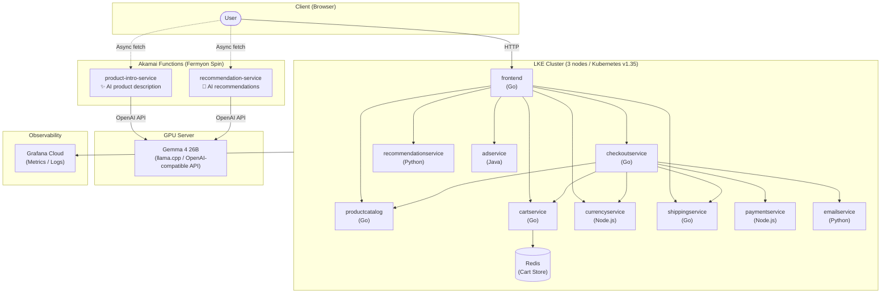

**English** | [日本語](./README.ja.md)

# Akamai Microservices Demo

> **An end-to-end demo environment combining Akamai's key services.**  
> A microservices e-commerce site running on LKE (Linode Kubernetes Engine), integrated with AI-powered features via Akamai Functions and full observability through Grafana Cloud.

[](https://github.com/ymori-aka/akamai-microservices-demo/actions/workflows/deploy.yml)

---

## Table of Contents

- [What You Can Demo](#what-you-can-demo)
- [Architecture](#architecture)
- [Tech Stack](#tech-stack)
- [Accessing the Demo Environment](#accessing-the-demo-environment)
- [Setup Guide](#setup-guide)
- [CI/CD Pipeline](#cicd-pipeline)
- [Using the Admin Panel](#using-the-admin-panel)
- [Repository Structure](#repository-structure)
- [License & Attribution](#license--attribution)

---

## What You Can Demo

| # | Scenario | Key Selling Point |
|---|----------|-------------------|
| 1 | **Running an e-commerce site on LKE** | Ease and scalability of managed Kubernetes |
| 2 | **AI product descriptions via Akamai Functions** | Edge Function calling a GPU-hosted LLM (Gemma 4) with low latency |
| 3 | **AI-powered personalized recommendations** | Dynamic product suggestions based on what the customer is viewing |
| 4 | **Real-time Japanese / English language switching** | One-click global-ready UI |
| 5 | **Full cluster observability with Grafana Cloud** | Unified metrics, logs, and traces for nodes, pods, and containers |
| 6 | **Automated deployments with GitHub Actions** | push → build → LKE deploy → Akamai Functions deploy, fully automated |
| 7 | **Authenticated admin panel** | Add, edit, delete products and manage inventory from a browser |

---

## Architecture



---

## Tech Stack

| Layer | Technology | Role |
|-------|-----------|------|
| **Infrastructure** | Linode Kubernetes Engine (LKE) | Kubernetes cluster (3 nodes) |
| **Edge AI** | Akamai Functions (Fermyon Spin v3.6.3) | TypeScript Wasm functions running at the edge |
| **AI Model** | Gemma 4 26B / llama.cpp | Open-source LLM on a GPU server |
| **Frontend** | Go + HTML templates | E-commerce storefront |
| **Microservices** | Go / Python / Node.js / Java | Cart, checkout, currency, shipping, etc. |
| **Observability** | Grafana Cloud + Grafana Alloy + Beyla | Metrics, logs, eBPF tracing |
| **CI/CD** | GitHub Actions + self-hosted runner | Automated build & deploy on push |
| **Container Registry** | GitHub Container Registry (ghcr.io) | Docker image storage |

---

## Accessing the Demo Environment

| URL | Description |
|-----|-------------|
| `http://172.233.68.25/` | E-commerce store (public) |
| `http://172.233.68.25/admin/inventory` | Admin panel (Basic Auth required) |

**Default admin credentials**

| Field | Value |
|-------|-------|
| Username | `admin` |
| Password | `akamai-demo` |

> Credentials can be changed via the `ADMIN_USER` / `ADMIN_PASSWORD` environment variables (see Step 8).

---

## Setup Guide

### Prerequisites

| Tool | Version | Purpose |
|------|---------|---------|
| kubectl | v1.28+ | Kubernetes operations |
| Spin CLI | v3.6.3 | Akamai Functions build & deploy |
| Spin aka plugin | v0.7.0 | Akamai Functions auth & deploy |
| Node.js | v20+ | Building Spin TypeScript apps |
| Linode CLI (optional) | latest | Creating the LKE cluster |

---

### Step 1 — Create an LKE Cluster

Create a cluster from the Akamai Cloud console or via the Linode CLI.

```bash
linode-cli lke cluster-create \
  --label akamai-demo \
  --region ap-northeast \
  --k8s_version 1.35 \
  --node_pools.type g6-standard-4 \
  --node_pools.count 3
```

Download the kubeconfig and verify connectivity.

```bash
linode-cli lke kubeconfig-view <cluster-id> --text | base64 -d > ~/.kube/config
kubectl get nodes   # All nodes should show Ready
```

---

### Step 2 — Deploy the Microservices

```bash
git clone https://github.com/ymori-aka/akamai-microservices-demo.git
cd akamai-microservices-demo

# Deploy all microservices at once
kubectl apply -f kubernetes-manifests/

# Set the platform badge to Akamai
kubectl set env deployment/frontend ENV_PLATFORM=akamai

# Wait for all pods to reach Running state (3–5 minutes)
kubectl get pods -w
```

---

### Step 3 — Load the Product Catalog

Product data is managed as a ConfigMap.

```bash
kubectl create configmap products-catalog \
  --from-file=products.json=./src/productcatalogservice/products.json
kubectl rollout restart deployment/productcatalogservice
```

---

### Step 4 — Set Up the Management Server (GitHub Actions self-hosted runner)

A management server (Ubuntu 24.04 recommended) with access to the LKE cluster is required for CI/CD.

**Install the GitHub Actions Runner**

```bash
# Go to: GitHub repo → Settings → Actions → Runners → New self-hosted runner
# Run the commands shown in the console (token is generated there)
mkdir -p ~/actions-runner && cd ~/actions-runner
curl -o actions-runner-linux-x64-2.321.0.tar.gz -L \
  https://github.com/actions/runner/releases/download/v2.321.0/actions-runner-linux-x64-2.321.0.tar.gz
tar xzf ./actions-runner-linux-x64-2.321.0.tar.gz
./config.sh --url https://github.com/ymori-aka/akamai-microservices-demo --token <TOKEN>
sudo ./svc.sh install && sudo ./svc.sh start
```

**Additional tools required on the management server**

```bash
# kubectl (with kubeconfig at ~/.kube/config)
curl -LO "https://dl.k8s.io/release/$(curl -sL https://dl.k8s.io/release/stable.txt)/bin/linux/amd64/kubectl"
sudo install -o root -g root -m 0755 kubectl /usr/local/bin/kubectl

# Spin CLI + aka plugin
curl -fsSL https://developer.fermyon.com/downloads/install.sh | bash
sudo mv spin /usr/local/bin/
spin plugins install aka

# Node.js v20
curl -fsSL https://deb.nodesource.com/setup_20.x | sudo -E bash -
sudo apt-get install -y nodejs
```

---

### Step 5 — Deploy to Akamai Functions

```bash
# Authenticate (first time only)
spin aka login

# recommendation-service
cd src/spin-functions/recommendation-service
npm install && npm run build
spin aka app link --app-name recommendation-service
spin aka app deploy --no-confirm

# product-intro-service
cd ../product-intro-service
npm install && npm run build
spin aka app link --app-name product-intro-service
spin aka app deploy --no-confirm
```

After deploying, update the endpoint URLs in `src/frontend/templates/product.html`:

```javascript
var introUrl = "https://<uuid>.fwf.app/intro?product_id=...";
var recUrl   = "https://<uuid>.fwf.app/recommendations?product_id=...";
```

---

### Step 6 — Configure GitHub Secrets

Go to **Settings → Secrets and variables → Actions** in your repository.

| Secret | Description |
|--------|-------------|
| `GHCR_TOKEN` | GitHub Personal Access Token with `write:packages` scope |

> The kubeconfig and Spin credentials live directly on the management server, so no additional secrets are needed.

---

### Step 7 — Set Up Grafana Cloud Monitoring

Open the Grafana Cloud console and go to **Connections → Add new connection → Kubernetes**.  
A ready-to-run Helm command will be generated — simply copy and run it.

```bash
helm repo add grafana https://grafana.github.io/helm-charts
helm repo update

kubectl create namespace monitoring

# Use the command generated in the Grafana Cloud console
helm install grafana-cloud-metrics grafana/k8s-monitoring \
  --namespace monitoring \
  --set ...
```

---

### Step 8 — Optional Environment Variables (frontend)

```bash
kubectl set env deployment/frontend \
  ENV_PLATFORM=akamai \         # Platform badge (akamai / gcp / aws / azure)
  ADMIN_USER=admin \            # Admin panel Basic Auth username
  ADMIN_PASSWORD=akamai-demo \  # Admin panel Basic Auth password
  ENABLE_ASSISTANT=true         # Enable AI shopping assistant (optional)
```

---

## CI/CD Pipeline

A push to `main` triggers three jobs:

```
push to main
    │
    ▼
┌──────────────────────────┐
│  Job 1: Build            │  GitHub-hosted runner (ubuntu-latest)
│  Frontend Docker Image   │  → ghcr.io/ymori-aka/frontend:sha-XXXXXXX
└────────────┬─────────────┘
             │ (runs in parallel after Job 1)
    ┌────────┴──────────────────────────────────┐
    │                                           │
    ▼                                           ▼
┌────────────────────────┐     ┌────────────────────────────────┐
│  Job 2: Deploy to LKE  │     │  Job 3: Deploy Spin Apps       │
│  (self-hosted runner)  │     │  to Akamai Functions           │
│                        │     │  (self-hosted runner)          │
│  kubectl set image ... │     │  recommendation-service        │
│  kubectl rollout ...   │     │  product-intro-service         │
└────────────────────────┘     └────────────────────────────────┘
```

---

## Using the Admin Panel

Navigate to `http://<FRONTEND_IP>/admin/inventory` (Basic Auth required).

| Action | How |
|--------|-----|
| Edit product name / description | Edit the cell directly → click "Save All Changes" |
| Change price / stock | Edit the numeric field → save |
| Replace product image | Click the thumbnail → select a file → save |
| Hide a product from the store | Check the "Hide" checkbox → save |
| Delete a product | Click 🗑 → confirm in the dialog |
| Add a new product | Fill in the form at the bottom → upload an image → click "Add" |

> **Note:** Uploaded images are stored on the pod's local filesystem and will be lost if the pod restarts.  
> For permanent storage, commit the image to `src/frontend/static/img/products/custom/` and redeploy via CI/CD.

---

## Repository Structure

```
.
├── .github/workflows/
│   └── deploy.yml                    # CI/CD pipeline definition
├── kubernetes-manifests/             # K8s manifests for all microservices
│   ├── frontend.yaml
│   ├── productcatalogservice.yaml
│   └── ...  (11 services total)
├── src/
│   ├── frontend/                     # ★ Primary modified service (Go)
│   │   ├── handlers.go               # Routing, business logic, admin API
│   │   ├── translations.go           # Japanese translation data (all products)
│   │   ├── main.go                   # Server startup & route definitions
│   │   ├── templates/                # HTML templates
│   │   │   ├── header.html           # Akamai logo, language toggle
│   │   │   ├── product.html          # AI intro & AI recommendations
│   │   │   └── inventory.html        # Admin product management UI
│   │   └── static/
│   │       ├── icons/akamai_logo.png # Akamai logo
│   │       └── img/products/         # Product images
│   ├── spin-functions/               # ★ Akamai Functions (TypeScript)
│   │   ├── recommendation-service/   # AI recommendations
│   │   └── product-intro-service/    # AI product description generation
│   └── productcatalogservice/
│       └── products.json             # Product catalog data (ConfigMap source)
└── README.md
```

---

## License & Attribution

This project is derived from [GoogleCloudPlatform/microservices-demo](https://github.com/GoogleCloudPlatform/microservices-demo) and used under the **Apache License 2.0**.

**Key modifications made:**

- Rebranded frontend to Akamai (logo, colors, product catalog)
- Added AI features via Akamai Functions (Fermyon Spin)
- Added Japanese / English language switching
- Added admin panel with full CRUD, Basic Auth, and image upload
- Integrated Grafana Cloud monitoring
- Added GitHub Actions CI/CD for automated LKE + Akamai Functions deployment

Copyright 2018 Google LLC (original code) — See [LICENSE](./LICENSE) for details.
