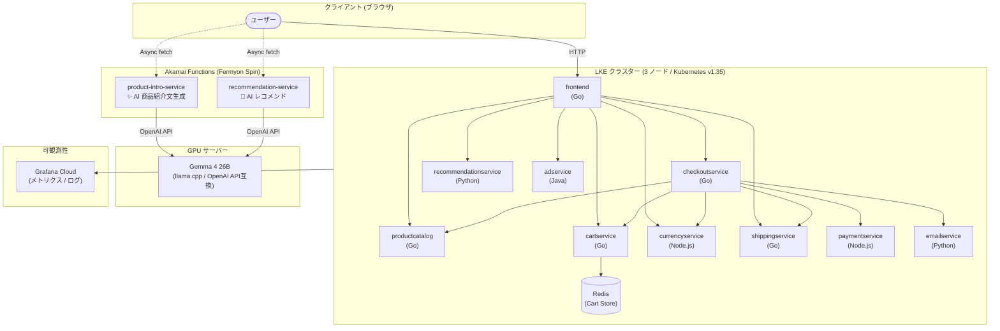

# Akamai Microservices Demo

> **Akamai の各種サービスを組み合わせた、エンドツーエンドのデモ環境です。**  
> LKE（Linode Kubernetes Engine）上のマイクロサービス EC サイトに、Akamai Functions による AI 機能・Grafana Cloud による可観測性を統合した、実際のユースケースを想定した構成になっています。

[](https://github.com/ymori-aka/akamai-microservices-demo/actions/workflows/deploy.yml)

---

## 目次

- [デモで見せられること](#デモで見せられること)
- [アーキテクチャ](#アーキテクチャ)
- [技術スタック](#技術スタック)
- [デモ環境へのアクセス](#デモ環境へのアクセス)
- [セットアップ手順](#セットアップ手順)
- [CI/CD パイプライン](#cicd-パイプライン)
- [商品管理画面の使い方](#商品管理画面の使い方)
- [リポジトリ構成](#リポジトリ構成)
- [ライセンス・派生元について](#ライセンス派生元について)

---

## デモで見せられること

| # | シナリオ | 訴求ポイント |
|---|----------|-------------|
| 1 | **EC サイトを LKE で運用** | マネージド Kubernetes の手軽さ、スケーラビリティ |
| 2 | **AI 商品紹介文を Akamai Functions で生成** | GPU サーバー（Gemma 4）をエッジ Function から呼び出し、低レイテンシで応答 |
| 3 | **AI によるパーソナライズドレコメンド** | 閲覧中の商品に応じて関連商品を動的に提案 |
| 4 | **日本語 / 英語 リアルタイム切替** | グローバル対応の UI をワンクリックで切替 |
| 5 | **Grafana Cloud でクラスター全体を可視化** | Node・Pod・コンテナのメトリクス・ログを一元管理 |
| 6 | **GitHub Actions で自動デプロイ** | push → ビルド → LKE デプロイ → Akamai Functions デプロイ を完全自動化 |
| 7 | **商品管理画面（認証付き）** | 商品の追加・削除・在庫管理・画像アップロードをブラウザから操作 |

---

## アーキテクチャ



---

## 技術スタック

| レイヤー | 技術 | 役割 |
|----------|------|------|
| **インフラ** | Linode Kubernetes Engine (LKE) | Kubernetes クラスター（3 ノード） |
| **エッジ AI** | Akamai Functions (Fermyon Spin v3.6.3) | TypeScript 製 Wasm Function をエッジで実行 |
| **AI モデル** | Gemma 4 26B / llama.cpp | GPU サーバー上のオープンソース LLM |
| **フロントエンド** | Go + HTML テンプレート | EC サイト本体 |
| **マイクロサービス** | Go / Python / Node.js / Java | カート・決済・通貨換算など各業務ロジック |
| **可観測性** | Grafana Cloud + Grafana Alloy + Beyla | メトリクス・ログ・eBPF トレーシング |
| **CI/CD** | GitHub Actions + self-hosted runner | push 時に自動ビルド & デプロイ |
| **コンテナレジストリ** | GitHub Container Registry (ghcr.io) | Docker イメージ管理 |

---

## デモ環境へのアクセス

| URL | 説明 |
|-----|------|
| `http://172.233.68.25/` | EC ストア（一般公開） |
| `http://172.233.68.25/admin/inventory` | 商品管理画面（Basic 認証あり） |

**管理画面のデフォルト認証情報**

| 項目 | 値 |
|------|----|
| ID | `admin` |
| パスワード | `akamai-demo` |

> 環境変数 `ADMIN_USER` / `ADMIN_PASSWORD` で変更できます（後述）。

---

## セットアップ手順

### 前提条件

| ツール | バージョン | 用途 |
|--------|-----------|------|
| kubectl | v1.28+ | Kubernetes 操作 |
| Spin CLI | v3.6.3 | Akamai Functions ビルド & デプロイ |
| Spin aka プラグイン | v0.7.0 | Akamai Functions 認証 & デプロイ |
| Node.js | v20+ | Spin TypeScript アプリのビルド |
| Linode CLI（任意） | latest | LKE クラスター作成 |

---

### Step 1 — LKE クラスターの作成

Akamai Cloud コンソールまたは Linode CLI でクラスターを作成します。

```bash
linode-cli lke cluster-create \
  --label akamai-demo \
  --region ap-northeast \
  --k8s_version 1.35 \
  --node_pools.type g6-standard-4 \
  --node_pools.count 3
```

作成後、kubeconfig をダウンロードしてローカルに配置します。

```bash
linode-cli lke kubeconfig-view <cluster-id> --text | base64 -d > ~/.kube/config
kubectl get nodes   # Ready が確認できれば OK
```

---

### Step 2 — マイクロサービスのデプロイ

```bash
git clone https://github.com/ymori-aka/akamai-microservices-demo.git
cd akamai-microservices-demo

# 全マイクロサービスを一括デプロイ
kubectl apply -f kubernetes-manifests/

# フロントエンドのプラットフォームバッジを Akamai に設定
kubectl set env deployment/frontend ENV_PLATFORM=akamai

# 全 Pod が Running になるまで待機（3〜5 分）
kubectl get pods -w
```

---

### Step 3 — 商品カタログの反映

商品データは ConfigMap で管理しています。

```bash
kubectl create configmap products-catalog \
  --from-file=products.json=./src/productcatalogservice/products.json
kubectl rollout restart deployment/productcatalogservice
```

---

### Step 4 — 管理サーバー（GitHub Actions self-hosted runner）のセットアップ

CI/CD には LKE にアクセス可能な管理サーバー（Ubuntu 24.04 推奨）が 1 台必要です。

**GitHub Actions Runner のインストール**

```bash
# GitHub リポジトリ → Settings → Actions → Runners → New self-hosted runner
# に表示されるコマンドを実行（トークンはコンソールで取得）
mkdir -p ~/actions-runner && cd ~/actions-runner
curl -o actions-runner-linux-x64-2.321.0.tar.gz -L \
  https://github.com/actions/runner/releases/download/v2.321.0/actions-runner-linux-x64-2.321.0.tar.gz
tar xzf ./actions-runner-linux-x64-2.321.0.tar.gz
./config.sh --url https://github.com/ymori-aka/akamai-microservices-demo --token <TOKEN>
sudo ./svc.sh install && sudo ./svc.sh start
```

**管理サーバーに必要な追加ツール**

```bash
# kubectl（kubeconfig は ~/.kube/config に配置）
curl -LO "https://dl.k8s.io/release/$(curl -sL https://dl.k8s.io/release/stable.txt)/bin/linux/amd64/kubectl"
sudo install -o root -g root -m 0755 kubectl /usr/local/bin/kubectl

# Spin CLI + aka プラグイン
curl -fsSL https://developer.fermyon.com/downloads/install.sh | bash
sudo mv spin /usr/local/bin/
spin plugins install aka

# Node.js v20
curl -fsSL https://deb.nodesource.com/setup_20.x | sudo -E bash -
sudo apt-get install -y nodejs
```

---

### Step 5 — Akamai Functions へのデプロイ

```bash
# 認証（初回のみ）
spin aka login

# recommendation-service
cd src/spin-functions/recommendation-service
npm install && npm run build
spin aka app link --app-name recommendation-service
spin aka app deploy --no-confirm

# product-intro-service
cd ../product-intro-service
npm install && npm run build
spin aka app link --app-name product-intro-service
spin aka app deploy --no-confirm
```

デプロイ後に発行される URL（`https://<uuid>.fwf.app`）を  
`src/frontend/templates/product.html` の以下の変数に設定してください。

```javascript
var introUrl = "https://<uuid>.fwf.app/intro?product_id=...";
var recUrl   = "https://<uuid>.fwf.app/recommendations?product_id=...";
```

---

### Step 6 — GitHub Secrets の設定

リポジトリの **Settings → Secrets and variables → Actions** で設定します。

| Secret 名 | 説明 |
|-----------|------|
| `GHCR_TOKEN` | GitHub Personal Access Token（`write:packages` スコープ必須） |

> kubeconfig・Spin 認証情報は管理サーバー上に直接配置するため、Secret への登録不要です。

---

### Step 7 — Grafana Cloud 監視のセットアップ

Grafana Cloud コンソール（**Connections → Add new connection → Kubernetes**）で  
Helm インストールコマンドが生成されます。そのコマンドをそのまま実行してください。

```bash
helm repo add grafana https://grafana.github.io/helm-charts
helm repo update

kubectl create namespace monitoring

# Grafana Cloud コンソールで生成されるコマンドを実行
helm install grafana-cloud-metrics grafana/k8s-monitoring \
  --namespace monitoring \
  --set ... # コンソールの指示に従う
```

---

### Step 8 — 環境変数の設定（オプション）

```bash
kubectl set env deployment/frontend \
  ENV_PLATFORM=akamai \         # プラットフォームバッジ（akamai / gcp / aws / azure）
  ADMIN_USER=admin \            # 管理画面 Basic 認証 ID
  ADMIN_PASSWORD=akamai-demo \  # 管理画面 Basic 認証パスワード
  ENABLE_ASSISTANT=true         # AI ショッピングアシスタント（オプション）
```

---

## CI/CD パイプライン

`main` ブランチへの push をトリガーに、以下の 3 ジョブが実行されます。

```
push to main
    │
    ▼
┌──────────────────────────┐
│  Job 1: Build            │  GitHub-hosted runner (ubuntu-latest)
│  Frontend Docker Image   │  → ghcr.io/ymori-aka/frontend:sha-XXXXXXX
└────────────┬─────────────┘
             │ (完了後、並列実行)
    ┌────────┴──────────────────────────────────┐
    │                                           │
    ▼                                           ▼
┌────────────────────────┐     ┌────────────────────────────────┐
│  Job 2: Deploy to LKE  │     │  Job 3: Deploy Spin Apps       │
│  (self-hosted runner)  │     │  to Akamai Functions           │
│                        │     │  (self-hosted runner)          │
│  kubectl set image ... │     │  recommendation-service        │
│  kubectl rollout ...   │     │  product-intro-service         │
└────────────────────────┘     └────────────────────────────────┘
```

---

## 商品管理画面の使い方

`http://<FRONTEND_IP>/admin/inventory` にアクセス（Basic 認証あり）。

| 操作 | 方法 |
|------|------|
| 商品名・説明文の編集 | 表の各セルを直接編集 → 「Save All Changes」をクリック |
| 価格・在庫の変更 | 数値セルを編集 → 保存 |
| 商品画像の変更 | サムネイルをクリック → ファイル選択 → 保存 |
| 商品の非表示 | 「Hide」列のチェックを ON → 保存 |
| 商品の削除 | 🗑 ボタン → 確認ダイアログ → 削除 |
| 新規商品の追加 | 画面下部のフォームに入力 → 画像をアップロード → 「追加」 |

> **注意:** アップロード画像は Pod のローカルストレージに保存されます。  
> 恒久的に保存したい場合は `src/frontend/static/img/products/custom/` に  
> 画像ファイルをコミットして CI/CD 経由でデプロイしてください。

---

## リポジトリ構成

```
.
├── .github/workflows/
│   └── deploy.yml                    # CI/CD パイプライン定義
├── kubernetes-manifests/             # 全マイクロサービスの K8s マニフェスト
│   ├── frontend.yaml
│   ├── productcatalogservice.yaml
│   └── ...（11 サービス分）
├── src/
│   ├── frontend/                     # ★ メイン改変箇所（Go）
│   │   ├── handlers.go               # ルーティング・ビジネスロジック・管理API
│   │   ├── translations.go           # 日本語翻訳データ（全商品）
│   │   ├── main.go                   # サーバー起動・ルーティング定義
│   │   ├── templates/                # HTML テンプレート
│   │   │   ├── header.html           # Akamai ロゴ・言語切替ボタン
│   │   │   ├── product.html          # AI 紹介文・AI レコメンド表示
│   │   │   └── inventory.html        # 商品管理画面
│   │   └── static/
│   │       ├── icons/akamai_logo.png # Akamai ロゴ
│   │       └── img/products/         # 商品画像
│   ├── spin-functions/               # ★ Akamai Functions（TypeScript）
│   │   ├── recommendation-service/   # AI レコメンド
│   │   └── product-intro-service/    # AI 商品紹介文生成
│   └── productcatalogservice/
│       └── products.json             # 商品カタログデータ（ConfigMap）
└── README.md
```

---

## ライセンス・派生元について

このプロジェクトは [GoogleCloudPlatform/microservices-demo](https://github.com/GoogleCloudPlatform/microservices-demo) を派生元とし、**Apache License 2.0** に従い改変・利用しています。

**主な変更点:**

- フロントエンドを Akamai ブランドに変更（ロゴ・カラー・商品カタログ）
- Akamai Functions（Fermyon Spin）による AI 機能を追加
- 日本語 / 英語切替機能を追加
- 商品管理画面（CRUD・Basic 認証・画像アップロード）を追加
- Grafana Cloud 監視統合を追加
- GitHub Actions による LKE + Akamai Functions への自動デプロイを追加

Copyright 2018 Google LLC（派生元コード） — See [LICENSE](./LICENSE) for details.
