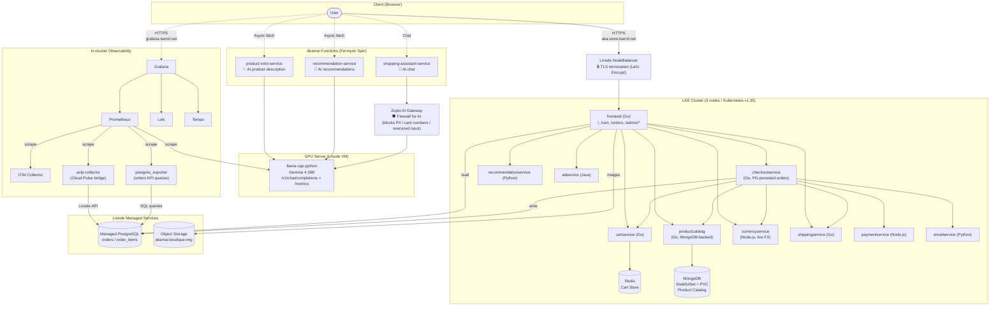

**English** | [日本語](./README.ja.md)

# Akamai Microservices Demo

> **An end-to-end demo environment combining Akamai's key services.**
> A microservices e-commerce site running on LKE (Linode Kubernetes Engine),
> with AI features at the edge (Akamai Functions), data persistence on
> Linode managed services, and full observability through an in-cluster
> Grafana stack augmented with Akamai Cloud Pulse.

[](https://github.com/ymori-aka/akamai-microservices-demo/actions/workflows/deploy.yml)

---

## Table of Contents

- [What You Can Demo](#what-you-can-demo)
- [Architecture](#architecture)
- [Tech Stack](#tech-stack)
- [Data Persistence](#data-persistence)
- [Observability](#observability)
- [Accessing the Demo Environment](#accessing-the-demo-environment)
- [Setup Guide](#setup-guide)
- [CI/CD Pipeline](#cicd-pipeline)
- [Using the Admin Panel](#using-the-admin-panel)
- [Repository Structure](#repository-structure)
- [License & Attribution](#license--attribution)

---

## What You Can Demo

| # | Scenario | Key Selling Point |
|---|----------|-------------------|
| 1 | **Running an e-commerce site on LKE** | Ease and scalability of managed Kubernetes |
| 2 | **AI product descriptions via Akamai Functions** | Edge Function calling a GPU-hosted LLM (Gemma 4) with low latency |
| 3 | **AI-powered personalized recommendations** | Dynamic product suggestions based on what the customer is viewing |
| 4 | **AI shopping assistant chat** | Spin function chat endpoint streaming Gemma responses |
| 5 | **Firewall for AI on the chat lane** | Chat prompts pass through a Zuplo AI Gateway that blocks credit-card numbers / PII and oversized (DoS-like) inputs before they reach the LLM |
| 6 | **4-language UI** | One-click switching between English / 日本語 / 한국어 / 中文 |
| 7 | **8-currency pricing** | USD / EUR / JPY / CAD / GBP / TRY / KRW / CNY with live FX rates |
| 8 | **Persistent order history** | Orders written to Linode Managed PostgreSQL; viewable at `/orders` & `/admin/orders` |
| 9 | **MongoDB-backed product catalog** | StatefulSet PVC with seed-on-first-start, full admin CRUD |
| 10 | **Product images on Linode Object Storage** | Images served from `*.linodeobjects.com` instead of in-cluster |
| 11 | **In-cluster Grafana + Cloud Pulse** | DB / LB / LLM metrics in a single dashboard; yesterday's and today's order count & revenue queried directly from PostgreSQL |
| 12 | **End-to-end LLM telemetry** | Token usage, latency p50/p95/p99, error rate per model |
| 13 | **Automated deployments with GitHub Actions** | push → build → LKE deploy → Akamai Functions deploy, fully automated |
| 14 | **Authenticated admin panel** | Add, edit, delete products and manage inventory from a browser |
| 15 | **Custom domain + HTTPS** | `tserof.net` zone on Linode DNS; Let's Encrypt TLS terminated directly at the Linode NodeBalancers for both the store and Grafana |

---

## Architecture



---

## Tech Stack

| Layer | Technology | Role |
|-------|-----------|------|
| **Infrastructure** | Linode Kubernetes Engine (LKE) | Kubernetes cluster (3 nodes) |
| **Edge AI** | Akamai Functions (Fermyon Spin v3.6.3) | TypeScript Wasm functions running at the edge |
| **AI Gateway** | Zuplo (Firewall for AI) | Screens chat prompts for PII / card numbers / oversized input before they reach the LLM |
| **AI Model** | Gemma 4 26B (MoE, 4B active) / llama-cpp-python | Open-source LLM on a GPU server, OpenAI-compatible API |
| **DNS & TLS** | Linode DNS (`tserof.net`) + Let's Encrypt | A records managed via `linode-cli`; TLS terminated at the NodeBalancers (`linode-loadbalancer-port-443` CCM annotation, shared 4-SAN cert) |
| **Frontend** | Go + HTML templates | E-commerce storefront (en / ja / ko / zh) |
| **Microservices** | Go / Python / Node.js / Java | Cart, checkout, currency, shipping, etc. |
| **Catalog Store** | MongoDB 7.0 (in-cluster StatefulSet + PVC) | Product catalog (auto-seeded from `products.json`) |
| **Orders Store** | Linode Managed PostgreSQL | Persistent `orders` / `order_items` tables |
| **Cart Store** | Redis | Ephemeral cart state |
| **Image Store** | Linode Object Storage | Public-read bucket serving `/static/img/products/*` |
| **Observability** | Prometheus / Loki / Tempo / Grafana / Grafana Alloy / Beyla / OTel Collector | Metrics, logs, traces, eBPF |
| **Managed-svc Metrics** | Akamai Cloud Pulse (`aclp-collector`) | DBaaS + NodeBalancer metrics scraped by Prometheus |
| **Business KPI Metrics** | `postgres_exporter` (custom queries) | Yesterday's & today's order count and revenue queried directly from PostgreSQL; exposed as Prometheus gauges |
| **LLM Metrics** | prometheus-fastapi-instrumentator + custom middleware | Token / latency / error rate per model |
| **CI/CD** | GitHub Actions + self-hosted runner | Automated build & deploy on push |
| **Container Registry** | GitHub Container Registry (ghcr.io) | Docker image storage |

---

## Data Persistence

Three data stores back the demo. All three are provisioned via Kubernetes
manifests + GitHub Secrets and deployed by CI on every push.

| Domain | Where | Schema / format |
|--------|-------|-----------------|
| **Product catalog** | MongoDB 7.0 StatefulSet inside the cluster (`mongodb-0`, 10 Gi PVC) | One document per product (`_id` = SKU, multilingual `name` / `description`, `price`, `categories`, `picture`, `stock`). Seeded on first start from `src/productcatalogservice/products.json`. |
| **Orders** | Linode Managed PostgreSQL (`postgresql v18`, jp-osa) | `orders(order_id UUID, session_id, email, shipping_*, total_*, created_at)` + `order_items(order_id, product_id, quantity, unit_price_*)`. Created on each CI run via a one-shot `orders-schema-migrate` Job. |
| **Carts** | Redis (in-cluster) | Ephemeral; per-session shopping cart. |

The frontend exposes:

- `GET /orders` — current session's order history (cookie-bound)
- `GET /admin/orders` — operator view of recent orders (Basic Auth)

Order persistence is non-blocking: if the DB is unreachable the
checkout still completes and a warning is logged.

---

## Observability

A self-managed stack runs inside the cluster in the `monitoring`
namespace, augmented by Akamai Cloud Pulse for Linode-managed
services.

| Component | What it provides |
|-----------|------------------|
| **Prometheus** | Scrapes microservices via OTel Collector + `aclp-collector` + `postgres_exporter` + LLM `/metrics` |
| **Loki** | Container logs (via Grafana Alloy) |
| **Tempo** | Distributed traces from microservices and Spin functions |
| **Grafana** | Two dashboards: *Akamai Store — Operations* and *Akamai Store — Infrastructure & LLM* |
| **`aclp-collector`** | OTel distribution maintained by Akamai; bridges Cloud Pulse → Prometheus for `dbaas` & `nodebalancer` metrics |
| **`postgres_exporter`** | Queries the `orders` table directly; exposes `orders_daily_*` (yesterday) and `orders_today_*` (current day) gauges for the Grafana business KPI panels |
| **LLM instrumentation** | `prometheus-fastapi-instrumentator` + custom token-counting middleware running inside the llama-cpp-python server |

**Cloud Pulse metrics surfaced:**

- *DBaaS (PostgreSQL)*: `avg_cpu_usage`, `avg_memory_usage`, `avg_disk_usage`, `avg_read_iops`, `avg_write_iops`
- *NodeBalancer*: pending account-level enablement (support ticket filed 2026-05-15). Config is ready in `aclp-collector.yaml`; uncomment once Akamai confirms access.

**Business KPI metrics (from PostgreSQL):**

- `orders_daily_order_count` — number of orders placed yesterday (UTC)
- `orders_daily_revenue_usd` — USD revenue from yesterday's orders
- `orders_today_order_count` — orders placed today so far (UTC)
- `orders_today_revenue_usd` — USD revenue from today's orders so far

**LLM metrics surfaced:**

- `llm_requests_total{model, endpoint, status}`
- `llm_request_duration_seconds_bucket` (latency histogram → p50 / p95 / p99)
- `llm_prompt_tokens_total`, `llm_completion_tokens_total`, `llm_total_tokens_total`

> **Object Storage (Cloud Pulse):** documented as a supported `service_type` but
> collector v1.0.0 does not implement it yet. Config is commented out in
> `aclp-collector.yaml` pending a stable image release.

---

## Accessing the Demo Environment

| URL | Description |
|-----|-------------|
| `https://aka-store.tserof.net/` | E-commerce store (public; also `https://tserof.net/` and `https://www.tserof.net/`) |
| `https://aka-store.tserof.net/orders` | Per-session order history |
| `https://aka-store.tserof.net/admin/inventory` | Admin product management (Basic Auth) |
| `https://aka-store.tserof.net/admin/orders` | Admin order list (Basic Auth) |
| `https://grafana.tserof.net/` | Grafana dashboards |

> DNS is hosted on Linode DNS (`tserof.net` zone) and TLS is terminated at the
> Linode NodeBalancers with a shared Let's Encrypt certificate
> (`tserof.net` / `www` / `aka-store` / `grafana` SANs). The certificate is
> rotated via the `deploy-tls-tserof-tokyo.yml` workflow. Plain HTTP on the
> NodeBalancer IPs still works as a fallback.

**Default admin credentials**

| Field | Value |
|-------|-------|
| Username | `admin` |
| Password | `akamai-demo` |

> Credentials can be changed via the `ADMIN_USER` / `ADMIN_PASSWORD` environment variables (see Step 8).

---

## Setup Guide

### Prerequisites

| Tool | Version | Purpose |
|------|---------|---------|
| kubectl | v1.28+ | Kubernetes operations |
| Spin CLI | v3.6.3 | Akamai Functions build & deploy |
| Spin aka plugin | v0.7.0 | Akamai Functions auth & deploy |
| Node.js | v20+ | Building Spin TypeScript apps |
| AWS CLI | latest | Uploading product images to Linode Object Storage (S3-compatible) |
| Linode CLI (optional) | latest | Creating the LKE cluster |

---

### Step 1 — Create an LKE Cluster

Create a cluster from the Akamai Cloud console or via the Linode CLI.

```bash
linode-cli lke cluster-create \
  --label akamai-demo \
  --region ap-northeast \
  --k8s_version 1.35 \
  --node_pools.type g6-standard-4 \
  --node_pools.count 3
```

Download the kubeconfig and verify connectivity.

```bash
linode-cli lke kubeconfig-view <cluster-id> --text | base64 -d > ~/.kube/config
kubectl get nodes   # All nodes should show Ready
```

---

### Step 2 — Provision Linode Managed Services

1. **Managed PostgreSQL** (Cloud Manager → Databases → Create)
   - Engine: PostgreSQL v16+, Region: same as the LKE cluster
   - After creation, open *Manage Networking* and enable **public access**
     (the LKE cluster cannot reach the VPC-private endpoint without
     LKE Enterprise; public access + IP allow-list is the supported
     path for non-Enterprise clusters)
   - Add the LKE node public IPs (or `0.0.0.0/0` for a closed demo)
     to the database firewall

2. **Object Storage bucket** (Cloud Manager → Object Storage → Create Bucket)
   - Label: `akamai-boutique-img` (or your own), Region: same as LKE
   - Create an Access Key with read/write on this bucket

3. Upload the bundled product images:

   ```bash
   aws configure --profile linode   # enter Access Key + Secret
   bash scripts/upload-product-images.sh
   ```

---

### Step 3 — Deploy the Microservices

```bash
git clone https://github.com/ymori-aka/akamai-microservices-demo.git
cd akamai-microservices-demo

# Deploy all microservices at once
kubectl apply -f kubernetes-manifests/

# Set the platform badge to Akamai
kubectl set env deployment/frontend ENV_PLATFORM=akamai

# Wait for all pods to reach Running state (3–5 minutes)
kubectl get pods -w
```

The product catalog is **self-seeding**: on first start, the
`productcatalogservice` reads `src/productcatalogservice/products.json`
(embedded in the image) and inserts every product into MongoDB if the
collection is empty. Subsequent restarts read from MongoDB only.

---

### Step 4 — Set Up the Management Server (GitHub Actions self-hosted runner)

A management server (Ubuntu 24.04 recommended) with access to the LKE cluster is required for CI/CD.

**Install the GitHub Actions Runner**

```bash
# Go to: GitHub repo → Settings → Actions → Runners → New self-hosted runner
# Run the commands shown in the console (token is generated there)
mkdir -p ~/actions-runner && cd ~/actions-runner
curl -o actions-runner-linux-x64-2.321.0.tar.gz -L \
  https://github.com/actions/runner/releases/download/v2.321.0/actions-runner-linux-x64-2.321.0.tar.gz
tar xzf ./actions-runner-linux-x64-2.321.0.tar.gz
./config.sh --url https://github.com/ymori-aka/akamai-microservices-demo --token <TOKEN>
sudo ./svc.sh install && sudo ./svc.sh start
```

**Additional tools required on the management server**

```bash
# kubectl (with kubeconfig at ~/.kube/config)
curl -LO "https://dl.k8s.io/release/$(curl -sL https://dl.k8s.io/release/stable.txt)/bin/linux/amd64/kubectl"
sudo install -o root -g root -m 0755 kubectl /usr/local/bin/kubectl

# Spin CLI + aka plugin
curl -fsSL https://developer.fermyon.com/downloads/install.sh | bash
sudo mv spin /usr/local/bin/
spin plugins install aka

# Node.js v20
curl -fsSL https://deb.nodesource.com/setup_20.x | sudo -E bash -
sudo apt-get install -y nodejs
```

---

### Step 5 — Deploy the Spin Apps to Akamai Functions

```bash
# Authenticate (first time only)
spin aka login

for svc in recommendation-service product-intro-service shopping-assistant-service; do
  (cd src/spin-functions/$svc \
    && npm install && npm run build \
    && spin aka app link --app-name $svc \
    && spin aka app deploy --no-confirm)
done
```

After deploying, update the endpoint URLs in `src/frontend/templates/product.html`
and the `SHOPPING_ASSISTANT_SERVICE_ADDR` env on `frontend.yaml`:

```text
https://<uuid-intro>.fwf.app/intro?product_id=...
https://<uuid-rec>.fwf.app/recommendations?product_id=...
https://<uuid-assistant>.fwf.app   # set on the frontend Deployment
```

---

### Step 6 — Configure GitHub Secrets

Go to **Settings → Secrets and variables → Actions** in your repository.

| Secret | Description |
|--------|-------------|
| `GHCR_TOKEN` | GitHub Personal Access Token with `write:packages` scope (CI pushes images to ghcr.io) |
| `KUBECONFIG_DATA` | Base64-encoded kubeconfig used by the self-hosted runner |
| `SPIN_AKA_ACCESS_TOKEN` | Akamai Functions deploy token (`spin aka login --token …`) |
| `ORDER_DB_DSN` | Postgres connection string: `postgres://akmadmin:<password>@<public-host>:23630/defaultdb?sslmode=require` |
| `LINODE_PAT` | Linode Personal Access Token with **Monitor: Read Only** and **Databases: Read Only** (used by `aclp-collector`) |

---

### Step 7 — Set Up the LLM Server (instrumented)

The LLM runs on a separate GPU VM as a systemd service. To make it
emit Prometheus metrics, wrap `llama_cpp.server` with
`prometheus-fastapi-instrumentator` + a small custom middleware. A
ready-to-use wrapper lives at
[`scripts/llm_server_instrumented.py`](scripts/llm_server_instrumented.py)
(deployed manually to `/root/llm_server_instrumented.py` on the LLM VM).

The systemd unit's `ExecStart` should invoke that wrapper instead of
`python -m llama_cpp.server` directly. The wrapper exposes:

- `/metrics` — standard HTTP metrics + `llm_*` token / latency counters
- All other routes unchanged (`/v1/chat/completions`, `/v1/models`, …)

Open inbound TCP/8000 from the LKE node public IPs in the VM's Cloud
Firewall so Prometheus can scrape it.

---

### Step 8 — Optional Environment Variables (frontend)

```bash
kubectl set env deployment/frontend \
  ENV_PLATFORM=akamai \         # Platform badge (akamai / gcp / aws / azure)
  ADMIN_USER=admin \            # Admin panel Basic Auth username
  ADMIN_PASSWORD=akamai-demo \  # Admin panel Basic Auth password
  ENABLE_ASSISTANT=true \       # Enable AI shopping assistant
  IMAGE_BASE_URL=https://akamai-boutique-img.jp-osa-1.linodeobjects.com
```

---

## CI/CD Pipeline

A push to `main` triggers parallel build jobs and a deploy job:

```
push to main
    │
    ├─► Build Frontend Image            (GitHub-hosted)
    ├─► Build Currency Service Image    (GitHub-hosted)
    ├─► Build Product Catalog Image     (GitHub-hosted)
    ├─► Build Checkout Service Image    (GitHub-hosted)
    │           │  all push to ghcr.io/ymori-aka/<svc>:sha-XXXXXXX
    │           ▼
    ├─► Deploy to LKE                   (self-hosted runner)
    │      ├─ kubectl apply -f kubernetes-manifests/...
    │      ├─ rollout frontend / checkoutservice / productcatalogservice
    │      ├─ create Secret orders-db-credentials (from ORDER_DB_DSN)
    │      ├─ run orders-schema-migrate Job
    │      ├─ deploy MongoDB StatefulSet (if absent)
    │      ├─ deploy monitoring stack + aclp-collector (if LINODE_PAT set)
    │      └─ seed admin-only products (AKMT028, AKMT029)
    │
    └─► Deploy Spin Apps to Akamai Functions
           recommendation / product-intro / shopping-assistant
```

---

## Using the Admin Panel

Navigate to `http://<FRONTEND_IP>/admin/inventory` (Basic Auth required).

| Action | How |
|--------|-----|
| Edit product name / description | Edit the cell directly → click "Save All Changes" |
| Change price / stock | Edit the numeric field → save |
| Replace product image | Click the thumbnail → select a file → save |
| Hide a product from the store | Check the "Hide" checkbox → save |
| Delete a product | Click 🗑 → confirm in the dialog |
| Add a new product | Fill in the form at the bottom → upload an image → click "Add" |

`http://<FRONTEND_IP>/admin/orders` (same Basic Auth) lists the most
recent 200 orders across all sessions, with shipping address, totals,
and line-items resolved from `orders` / `order_items`.

> **Image storage:** picture URLs that begin with `/static/img/products/`
> are rewritten to the `IMAGE_BASE_URL` (Linode Object Storage) at
> render time. Images uploaded via the admin panel are currently
> persisted to the pod's local filesystem only — for permanent storage,
> upload to the bucket (`scripts/upload-product-images.sh`) and commit
> the corresponding entry.

---

## Repository Structure

```
.
├── .github/workflows/
│   └── deploy.yml                    # CI/CD pipeline definition
├── kubernetes-manifests/
│   ├── frontend.yaml                 # incl. ORDER_DB_DSN, IMAGE_BASE_URL envs
│   ├── productcatalogservice.yaml    # MongoDB-backed
│   ├── checkoutservice.yaml          # PG-backed orders
│   ├── mongodb.yaml                  # StatefulSet + PVC + Secret
│   ├── orders-schema.sql             # PG schema (applied by Job)
│   ├── orders-migrate-job.yaml       # One-shot psql migrator
│   ├── loadgenerator.yaml            # Overlay with custom locustfile
│   └── monitoring/
│       ├── prometheus.yaml
│       ├── grafana.yaml
│       ├── grafana-dashboards.yaml   # Operations + Infrastructure & LLM
│       ├── aclp-collector.yaml       # Akamai Cloud Pulse → Prometheus
│       ├── postgres-exporter.yaml    # Orders KPI queries → Prometheus gauges
│       ├── otel-collector.yaml
│       └── redis-exporter.yaml
├── scripts/
│   ├── upload-product-images.sh      # Sync ./src/.../products/ → Object Storage
│   └── llm_server_instrumented.py    # llama_cpp.server + Prometheus instrumentation
├── src/
│   ├── frontend/                     # ★ Primary modified service (Go)
│   │   ├── handlers.go               # Routing, business logic, admin API
│   │   ├── orders_db.go              # PG read for /orders & /admin/orders
│   │   ├── translations.go           # ja / ko / zh translations
│   │   ├── main.go                   # Server startup & route definitions
│   │   ├── templates/
│   │   │   ├── header.html           # Akamai logo, lang/currency toggle, /orders icon
│   │   │   ├── product.html          # AI intro & AI recommendations
│   │   │   ├── orders.html           # Order history page (used by both views)
│   │   │   └── inventory.html        # Admin product management UI
│   │   └── static/img/products/      # Source images (mirrored to Object Storage)
│   ├── checkoutservice/
│   │   └── orders_db.go              # PG write of placed orders
│   ├── productcatalogservice/
│   │   ├── catalog_loader_mongo.go   # MongoDB loader & seeder
│   │   └── products.json             # Seed data
│   └── spin-functions/               # ★ Akamai Functions (TypeScript)
│       ├── recommendation-service/
│       ├── product-intro-service/
│       └── shopping-assistant-service/
└── README.md
```

---

## License & Attribution

This project is derived from [GoogleCloudPlatform/microservices-demo](https://github.com/GoogleCloudPlatform/microservices-demo) and used under the **Apache License 2.0**.

**Key modifications made:**

- Rebranded frontend to Akamai (logo, colors, product catalog)
- 4-language UI (en / ja / ko / zh) and 8-currency pricing with live FX
- AI features via Akamai Functions (Fermyon Spin): product intros,
  recommendations, shopping assistant chat
- Admin panel with full CRUD, Basic Auth, image upload
- Product catalog migrated to MongoDB (in-cluster StatefulSet, auto-seeded)
- Order persistence to Linode Managed PostgreSQL with `/orders` &
  `/admin/orders` pages
- Product images served from Linode Object Storage
- In-cluster Prometheus / Loki / Tempo / Grafana stack
- Akamai Cloud Pulse integration via `aclp-collector` for DBaaS &
  NodeBalancer metrics
- `postgres_exporter` with custom SQL queries for real-time business KPIs
  (yesterday's and today's order count & revenue) surfaced in Grafana
- LLM server instrumented with HTTP + token / latency Prometheus metrics
- GitHub Actions CI/CD for automated LKE + Akamai Functions deployment

Copyright 2018 Google LLC (original code) — See [LICENSE](./LICENSE) for details.
